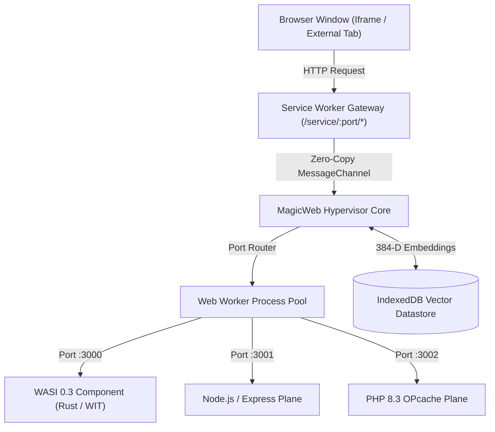

# Project MagicWeb v3.2: In-Browser WASI Hypervisor & Polyglot Mesh

<div align="center">

[](LICENSE)
[](https://wasi.dev/)
[](https://web.dev/coop-coep/)
[](.github/workflows/ci.yml)
[](https://github.com/VEFAorg/magicweb-hypervisor)

**A 2026-Standard In-Browser Cloud Hypervisor, Worker Process Pool, and Zero-Copy Virtual Microservice Mesh.**

[Live Demo](https://vefaorg.github.io/magicweb-hypervisor/) • [Architecture](#-architecture) • [Quick Start](#-quick-start) • [WASI Component Model](#-wasi-component-model) • [Contributing](CONTRIBUTING.md)

</div>

---

## ⚡ What is MagicWeb?

**MagicWeb** compiles and virtualizes an entire multi-tenant cloud environment directly inside any modern web browser. It combines:
1. **WebAssembly Linear Memory Sandbox**: Sub-millisecond execution of WASI 0.3 components and SIMD matrix operations.
2. **Dedicated Web Worker Process Pool**: True process isolation per microservice with independent event loops and virtual ports (`:3000`, `:3001`, `:3002`, ...).
3. **Transparent Service Worker Loopback Gateway**: Intercepts `/service/:port/*` calls and pipes them through zero-copy `MessageChannel` queues directly into running services.
4. **384-D Local Vector Grounding**: Instant semantic code retrieval and citations via IndexedDB storage without cloud dependencies or API keys.



---

## 🚀 Quick Start

### 1. Prerequisites
- [Node.js](https://nodejs.org/) v18+ (for local development server)
- Modern browser with WebAssembly and Web Workers (Chrome 120+, Edge 120+, Firefox 122+, Safari 17+)

### 2. Run Locally
```bash
git clone https://github.com/VEFAorg/magicweb-hypervisor.git
cd magicweb-hypervisor
npm start
```
Then navigate to **`http://localhost:8080/`**.
*(The dev server enforces `Cross-Origin-Opener-Policy: same-origin` and `Cross-Origin-Embedder-Policy: credentialless` for hardware `SharedArrayBuffer` acceleration).*

---

## 📦 Run as Native Desktop App (.exe)

Compile the standalone native desktop application (with embedded zero-dependency WebAssembly runtime):
```powershell
cd desktop
go build -ldflags="-s -w" -o "MagicWeb-Hypervisor.exe" .
.\MagicWeb-Hypervisor.exe
```

---

## 🧪 Automated Testing

Run the automated contract and mathematical validation suite:
```bash
npm test
```

Verifies:
- 384-D L2 vector normalization and cosine similarity bounds
- Sub-word chunking and multi-scale semantic projections
- Dual-Plane file-based classification accuracy

---

## 🏛️ Repository Structure

```
magicweb-hypervisor/
├── .github/
│   └── workflows/
│       ├── ci.yml                 # Automated quality gate & contract verification
│       ├── deploy-pages.yml       # Automated GitHub Pages continuous deployment
│       └── release.yml            # Multi-platform native executable builder
├── src/
│   ├── ai/
│   │   └── embeddings.js          # 384-D L2-normalized semantic vector engine
│   ├── core/
│   │   ├── process_manager.js     # Web Worker process pool & port dispatcher
│   │   └── process_worker.js      # Isolated in-browser microservice runner
│   ├── gateway/
│   │   └── sw.js                  # Transparent loopback Service Worker
│   ├── planes/
│   │   └── classifier.js          # Dual-Plane workload classifier (WASI vs Linux)
│   └── storage/
│       └── indexeddb.js           # Multi-GB datastore & vector persistence
├── tests/
│   └── runner.js                  # Automated test runner
├── desktop/
│   └── main.go                    # Native Go standalone desktop runtime
├── index.html                     # Hypervisor dashboard & Portal Viewport
├── serve.js                       # COOP/COEP isolation server
├── package.json                   # Metadata & scripts
└── LICENSE                        # MIT License
```

---

## 📜 Community & License

Maintained by the **VEFA Engineering Team** ([www.VEFA.club](https://www.vefa.club)).  
Released under the [MIT License](LICENSE).
